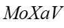
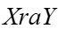
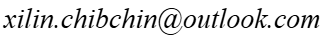
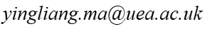

# <p align="center">MOSXAV: A Benchmark Dataset for Multi-Object Segmentation in X-ray Angiography Videos</p>

<p align="center">
  <a href="https://xilin-x.github.io/MOSXAV/" target="_blank">
    
  </a>
  &nbsp;&nbsp;
  <a href="https://huggingface.co/datasets/xilin-x/MOSXAV" target="_blank">
    
  </a>
</p>

<p align="center">
  <b>VOS Task:</b>
  &nbsp;&nbsp;
  <a href="https://arxiv.org/abs/2601.00988" target="_blank">
    
  </a>
  &nbsp;&nbsp; | &nbsp;&nbsp;
  <b>Semantic Segmentation Task:</b>
  &nbsp;&nbsp;
  <a href="https://link.springer.com/chapter/10.1007/978-3-032-05472-2_2" target="_blank">
    
  </a>
  &nbsp;
  <a href="https://arxiv.org/abs/2507.16429" target="_blank">
    
  </a>
</p>

---

## 📖 1. Overview

**MOSXAV** is a benchmark dataset designed for **multi-object segmentation** in X-ray angiography videos. It provides **high-quality, manually annotated segmentation ground truth**, supporting the analysis of vascular structures in dynamic medical imaging. Each video contains **33&sim;70** frames at a resolution of **512&times;512 pixels**. Vascular regions are annotated by experienced radiologists, with annotations focused on **one or two key frames** where the contrast agent is most prominent.

- The **training and validation sets** include **30 sequences** (2,335 frames), with **annotations every 5 frames**.
- The **test set** consists of **12 sequences** (488 frames), with **frame-level annotations** throughout.

MOSXAV provides a valuable resource for the development and benchmarking of methods in X-ray angiography video segmentation.

---

## 🛠️ 2. Annotation Protocol

To ensure high-quality and anatomically accurate labels, we implemented a rigorous, multi-stage annotation workflow. This process combined the efficiency of deep learning with the precision of manual expert refinement. The protocol consisted of four primary phases:

* **Annotator Training:** Annotators were trained on a specialized subset of images to standardize their understanding of anatomical structures and specific labeling guidelines.
* **Semi-Automated Initialization:** We utilized a semi-automated approach to generate initial segmentation masks. This was powered by the [PaddleSeg](https://github.com/PaddlePaddle/PaddleSeg) framework, leveraging models pre-trained on extensive image and video datasets to provide a robust baseline.
* **Expert Revision:** Human annotators meticulously reviewed the AI-generated masks. This involved careful delineation of vessel boundaries and manual adjustments to correct any discrepancies in the automated output.
* **Consensus & Quality Assurance:** To maintain consistency, a final review and consensus-building phase were conducted, ensuring that all labels met our strict quality benchmarks.

---

## 📊 3. Object Categories and Statistics

The **MOSXAV dataset** is designed to support two distinct medical imaging challenges: Video Object Segmentation (VOS) and Multi-class Semantic Segmentation.

### 3.1 Video Object Segmentation (VOS)

The VOS task focuses on the temporal tracking and segmentation of coronary arteries as they are opacified by contrast agents. This task requires high temporal consistency across video sequences:
* **Objective**: Segmenting coronary arteries filled with contrast agents throughout the cardiac cycle.
* **Object Density**: **Train & Val Sets:** Up to 5 individual objects per sequence. **Test Set:** Increased complexity with up to 10 individual objects per sequence to evaluate model scalability and robustness.

### 3.2 Semantic Segmentation

The semantic segmentation task targets the simultaneous identification of critical intervention tools and anatomical features. We define four primary categories:

| Category | Label ID | Color Preview | RGB Color | Description |
| :--- | :---: | :---: | :---: | :--- |
| **Background** | 0 |  | `[0,0,0]` | All pixels not belonging to the below classes, including the spine, ribs, diaphragm, and image noise. |
| **Vessel** | 1 |  | `[85,170,255]` | The primary coronary anatomy under observation. |
| **Contrast Catheter** | 2 |  | `[170,255,0]` | The specific catheter used for dye injection. |
| **Catheter** | 3 |  | `[249,193,0]` | General-purpose intervention or diagnostic catheters. |
| **Balloon** | 4 |  | `[255,0,0]` | Angioplasty balloons used during interventional procedures. |
| **Others** | 5 |  | `[244,108,59]` | Other category. |

### 3.3 File Structure

The MOSXAV dataset is organized into a hierarchical directory structure to support both video-level (VOS) and frame-level (Semantic Segmentation) tasks. The data is split into ```trainval```, and ```test``` directories, each containing the original sequences and their corresponding pixel-level annotations.

```text
MOSXAV_Dataset/
├── trainval/
│   ├── Annotations/                # VOS instance masks (unique ID per branch)
│   │   └── v00/                    # Sequence folder
│   │       ├── 00000.png           # Frame-wise instance mask
│   │       └── ...
│   ├── Annotations_Semantic/       # Multi-class semantic masks (Label IDs 0-4)
│   │   └── v00/
│   │       ├── 00000.png
│   │       └── ...
│   ├── JPEGImages/                 # Raw X-ray Angiography frames
│   │   └── v00/
│   │       ├── 00000.jpg
│   │       └── ...
│   ├── ImageSets/                  # Split lists and first-frame metadata
│   │   ├── train.txt
│   │   ├── val.txt
│   │   └── val_first_mask.json     # Frame ID of each object's first appearance
│   └── labels.json                 # Global category metadata
└── test/
    ├── Annotations/
    ├── Annotations_Semantic/       # Multi-class semantic masks (Label IDs 0-5)
    ├── JPEGImages/
    ├── ImageSets/
    │   ├── test.txt
    │   └── test_first_mask.json    # Frame ID of each object's first appearance, along with the seen and unseen object classes in the training set
    └── labels.json
```

---

## 📥 4. Download

The MOSXAV Dataset is hosted across multiple cloud storage platforms to ensure accessibility and high download speeds globally.

| Source | Download Link | Extraction Code / Notes |
| :---: | :---: | :---: |
| **OneDrive** | [🌐 Click Here](https://1drv.ms/f/c/05b6df5b859ecdde/IgBLUOUDkt5bQ4S80HI2Gb_7AZW-uXoxuXuFPXCrwOUrBPo?e=6fBF22) |  |
| **Google Drive** | [🌐 Click Here](https://drive.google.com/drive/folders/1d-kOWF7TkXqkRAfmh0ugkEvT9NmXr3cP?usp=sharing) | - |
| **Baidu Pan** | [🌐 Click Here](https://pan.baidu.com/s/1-1i6nljdrdp90tMg30bZwQ) |  |
| **Hugging Face** | [🌐 Click Here](https://huggingface.co/datasets/xilin-x/MOSXAV) | - |

---

## ⚖️ 5. License

The dataset is licensed under a [Creative Commons Attribution-NonCommercial-ShareAlike 4.0 International License](https://creativecommons.org/licenses/by-nc-sa/4.0/). See [LICENSE](./LICENSE) for details.

<br>
<p align="left">
  <a rel="license" href="http://creativecommons.org/licenses/by-nc-sa/4.0/">
    
  </a>
</p>

---

## 📝 Citation

Please consider citing MOSXAV if it helps your research.

```bibtex
@article{FSVOSXA,
    title={Few-Shot Video Object Segmentation in X-Ray Angiography Using Local Matching and Spatio-Temporal Consistency Loss},
    author={Xi, Lin and Ma, Yingliang and Zhuang, Xiahai},
    journal={arXiv preprint arXiv:2601.00988},
    year={2026}
}
```

```bibtex
@InProceedings{RNPLL,
    author={Xi, Lin and Ma, Yingliang and Wang, Cheng and Howell, Sandra and Rinaldi, Aldo and Rhode, Kawal S.},
    title={Robust Noisy Pseudo-Label Learning for Semi-supervised Medical Image Segmentation Using Diffusion Model},
    booktitle={Deep Generative Models Workshop, International Conference on Medical Image Computing and Computer-Assisted Intervention (DGM4MICCAI)},
    year={2026},
    pages={12--23}
}
```

---

## ✉️ Contact

For questions or feedback, please contact:
* Lin Xi: 
* Yingliang Ma: 

---
<p align="center">
  Copyright © 2026 MOSXAV Project Team. All rights reserved.
</p>